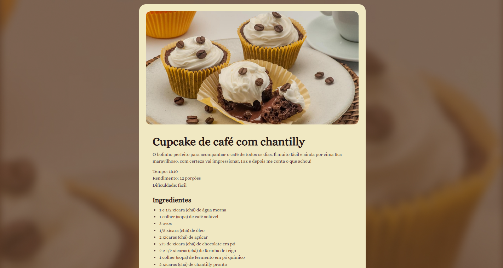

# 🍽️ Página de Receita

Projeto desenvolvido como parte dos estudos da Rocketseat, apresentando uma página simples e estilizada de uma receita utilizando **HTML** e **CSS**.

---

## 📸 Demonstração



---

## 🚀 Tecnologias Utilizadas

- **HTML5**
- **CSS3**

---

## 📚 Sobre o Projeto

Este projeto consiste em uma página estática que exibe uma receita culinária.  
O objetivo é praticar:

- Estruturação semântica em HTML  
- Estilização com CSS  
- Organização visual e tipográfica  
- Boas práticas em desenvolvimento front-end

---

## 📂 Estrutura de Pastas
```bash
/
├── index.html
├── style.css
└── assets/
    └── (imagens, ícones, etc.)
```


---

## 💻 Como Executar

1. Clone este repositório:
   
   ```bash
   git clone https://github.com/seu-usuario/pagina-receita.git

2. Abra o arquivo index.html diretamente no navegador.

---

## 🔧 Melhorias Futuras

- Adicionar responsividade.

- Criar um layout mais elaborado usando Flexbox ou CSS Grid.

- Incluir animações e transições.

- Adicionar modo escuro (dark mode).

- Transformar em uma página dinâmica com JavaScript.

---

## 📄 Licença

Este projeto foi desenvolvido para fins educacionais como parte dos estudos da Rocketseat.
